<!-- ═══════════════ HEADER (animated waving banner) ═══════════════ -->
<p align="center">
  
</p>

<!-- ═══════════════ TYPING ANIMATION ═══════════════ -->
<p align="center">
  <a href="https://eltoffer.vercel.app/">
    
  </a>
</p>

<p align="center">
  <a href="https://eltoffer.vercel.app/"></a>
  <a href="https://www.linkedin.com/in/kristoffer-lazarte-7a416b283"></a>
  <a href="https://github.com/nice2ceeu"></a>
</p>

<p align="center">
  
</p>

---

## `$ whoami`

```java
public class Kristoffer extends SoftwareEngineer {

    private final String role     = "Junior Software Engineer";
    private final String location = "Philippines 🇵🇭";
    private final String mission  = "Turning real-world needs into dependable software";

    private final List<String> languages = List.of(
        "Java", "TypeScript", "JavaScript", "PHP"
    );

    private final List<String> frameworks = List.of(
        "Spring Boot", "React", "Next.js", "Angular", "Node.js"
    );

    private final List<String> deployedOn = List.of(
        "Docker", "Aiven", "Firebase", "Azure", "Render", "Vercel"
    );

    private final List<String> aiTools = List.of(
        "Claude Code", "Codex", "Gemini"
    );

    public void dailyRoutine() {
        while (alive()) {
            designRestApis();
            secureEverything();      // auth, authz, rate limiting
            cacheWhatMatters();
            shipWithDocker();
            keepLearning();          // scalable backend + cloud deployment
        }
    }

    public boolean openToWork() {
        return true;                 // junior SWE / backend roles & collabs
    }
}
```

---

## `$ cat tech-stack.txt`

**Languages & Frameworks**

<p>
  
</p>

**Databases, Cloud & Tools**

<p>
  
</p>

---

## `$ cat ai-tools.txt`

<p>
  
  
  
</p>

---

## `$ ls ~/projects`

| Project | What It Does | Tech |
| --- | --- | --- |
| **[Blue Coral](https://bluecoralph.com)** | Connects employers with nearby skilled workers using map-based discovery, secure authentication, payments, caching, rate limiting, and a Dockerized backend. | Spring Boot, React, Docker, Tailwind CSS |
| **[LiteBox](https://liteboxph.vercel.app)** | Image-storage SaaS with generated API credentials, Cloudinary uploads, subscriptions, OAuth sign-in, and idempotent PayMongo payments. | Spring Boot, React, Aiven |
| **[Agribilis](https://agribilis.vercel.app)** | Agricultural marketplace with online purchasing, PayMongo payments, Docker deployment, and administrative journal entries. | PHP, React, Docker, MySQL |
| **[Kawit Tourism Portal](https://kawit-tawny.vercel.app)** | Tourism platform with attraction discovery, reservations, Azure Maps navigation, an AI-assisted chatbot, and admin analytics. | Next.js, Firebase, Azure |
| **[Cointainer](https://cointainer.vercel.app)** *(🚧 In progress)* | Digital wallet with PostgreSQL-backed transaction workflows and idempotent PayMongo payment processing. | Spring Boot, Angular, PostgreSQL |
| **[Debt Tracker](https://tutoytracker.vercel.app)** | Organizes debts and upcoming due dates with real-time data, authentication, Cloud Functions, and push notifications. | Next.js, Firebase |
| **[Cheap Chat](https://cheapchatph.vercel.app)** | Real-time messaging with WebSockets, MongoDB persistence, account recovery, and transactional email. | Node.js, MongoDB, Angular |
| **[SkySnap](https://skysnapph.vercel.app)** | Responsive weather application built to practice public API integration and asynchronous data handling. | Next.js |

---

## `$ git log --focus`

```diff
+ REST API design and integration
+ Secure authentication and authorization
+ Relational and NoSQL database design
+ Caching, rate limiting, and pagination
+ Payment integrations and idempotency
+ Dockerized deployment and cloud hosting
+ SOLID principles and clean architecture
```

---

## `$ ./run-backend.sh`

<!-- Both animations are self-hosted SVGs in assets/ so they can never break like third-party stat cards -->
<p align="center">
  
</p>

<p align="center">
  
</p>

---

## `$ ./connect.sh`

```bash
$ echo "Open to junior software engineering & backend development opportunities"
$ echo "Also up for collaborations on practical web applications"
$ ping kristoffer --connect
  64 bytes from portfolio: icmp_seq=1 ttl=64 time=0.1 ms  ✔
```

<p align="center">
  <a href="https://eltoffer.vercel.app/">
    
  </a>
  <a href="https://www.linkedin.com/in/kristoffer-lazarte-7a416b283">
    
  </a>
</p>

<p align="center">
  
</p>

<!-- ═══════════════ FOOTER (animated waving banner) ═══════════════ -->
<p align="center">
  
</p>
